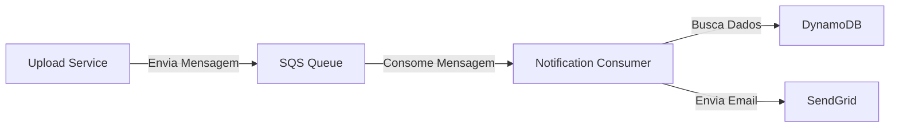
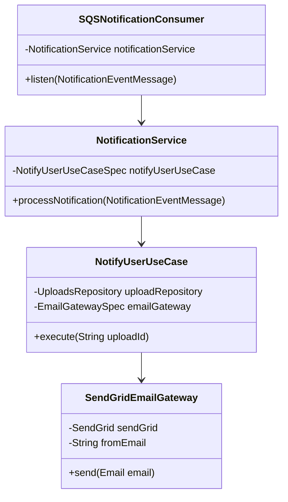

# Notification Consumer - FIAP Hackathon 🚀
[](https://sonarcloud.io/summary/new_code?id=fiap-8soat-tc-one_hackathon-fiap-notification-consumer)
[](https://github.com/fiap-8soat-tc-one/hackathon-fiap-notification-consumer/actions/workflows/build.yml)

## 📘 Visão Geral

Este projeto é um microsserviço de notificações desenvolvido para o Hackathon FIAP, responsável por processar eventos de notificação via Amazon SQS e enviar e-mails usando o SendGrid. O serviço faz parte de uma arquitetura maior que processa uploads de vídeos e notifica os usuários sobre o status do processamento.

## 🛠️ Tecnologias Utilizadas

### Core
- **Java 21**
- **Spring Boot 3.2.3**
- **Maven 3.9.9**

### AWS Services
- **Amazon SQS** - Serviço de filas para processamento de mensagens
- **Amazon DynamoDB** - Banco de dados NoSQL para armazenamento de dados
- **Amazon ECR** - Registro de containers para imagens Docker

### Outros
- **SendGrid** - Serviço de envio de e-mails
- **Docker** - Containerização da aplicação
- **Kubernetes** - Orquestração de containers
- **LocalStack** - Emulação de serviços AWS localmente
- **JaCoCo** - Cobertura de testes
- **SonarQube** - Análise de qualidade de código
- **GitHub Actions** - CI/CD

## 🏗️ Arquitetura do Projeto

### Estrutura de Pacotes
```
src/
├── main/
│   ├── java/
│   │   └── com/
│   │       └── fiap/
│   │           └── hackaton/
│   │               ├── core/
│   │               │   ├── domain/
│   │               │   │   ├── entities/       # Domain entities
│   │               │   │   └── exceptions/     # Custom exceptions
│   │               │   └── usecases/           # Application use cases
│   │               ├── infrastructure/
│   │               │   ├── gateways/           # External interface implementations
│   │               │   ├── messaging/          # Message consumers
│   │               │   ├── model/              # DTOs and models
│   │               │   ├── persistence/        # Repositories
│   │               │   └── workers/            # Processing workers
│   │               │       └── dto/            # Data transfer objects
│   │               └── services/               # Application services
│   └── resources/
│       └── application.yml                     # Application configurations
```

## 🔄 Fluxo da Aplicação



## 📊 Diagrama de Classes Principal



## 🚀 Como Executar

### Pré-requisitos
- Java 21
- Maven 3.9+
- Docker & Docker Compose
- AWS CLI (para testes locais com LocalStack)

### Configuração Local

1. Clone o repositório
```bash
git clone https://github.com/seu-usuario/hackathon-fiap-notification-consumer.git
cd hackathon-fiap-notification-consumer
```

2. Configure as variáveis de ambiente
```bash
export AWS_ACCESS_KEY_ID=your_access_key
export AWS_SECRET_ACCESS_KEY=your_secret_key
export AWS_REGION=us-east-1
export SENDGRID_API_KEY=your_sendgrid_key
export SENDGRID_FROM_EMAIL=your_email
```

3. Execute com Docker Compose
```bash
docker-compose up -d
```

4. Execute a aplicação
```bash
./mvnw spring-boot:run
```

## 📧 Formato das Mensagens

### Mensagem SQS de Entrada
```json
{
    "id": "uuid-do-upload",
    "status": "PROCESSED",
    "message": "Processamento concluído"
}
```

### Email de Saída
- **Assunto**: "Processamento de video concluido"
- **Corpo**: Inclui status do processamento e link para download (se disponível)

## 🔍 Testes

```bash
# Executar todos os testes
mvn test

# Executar testes com cobertura
mvn verify
```

## 📦 Deploy

O deploy é realizado automaticamente via GitHub Actions quando há push na branch main:

1. Build e testes
2. Análise de código com SonarQube
3. Build da imagem Docker
4. Push para Amazon ECR
5. Deploy no EKS

## ⚙️ Configurações

### application.yml
```yaml
spring:
  application:
    name: notification-consumer

  cloud:
    aws:
      credentials:
        access-key: ${AWS_ACCESS_KEY_ID}
        secret-key: ${AWS_SECRET_ACCESS_KEY}
      region:
        static: ${AWS_REGION}
      sqs:
        endpoint: ${SQS_ENDPOINT}
      dynamodb:
        endpoint: ${DYNAMO_DB_ENDPOINT}
        table-prefix: fiap-hackaton-
app:
  message-broker:
    event:
      notification:
        queue-name: notification-event-queue
sendgrid:
  api-key: ${SENDGRID_API_KEY}
  email:
    from: ${SENDGRID_FROM_EMAIL}
```

## 🤝 Contribuições

1. Fork o projeto
2. Crie uma branch (`git checkout -b feature/amazing-feature`)
3. Commit suas mudanças (`git commit -m 'Add amazing feature'`)
4. Push para a branch (`git push origin feature/amazing-feature`)
5. Abra um Pull Request

## 📝 Licença

Este projeto está sob a licença GNU General Public License v3.0.

## ✉️ Contato

Para dúvidas ou sugestões, entre em contato com o time técnico do FIAP 8SOAT TEAM 32.